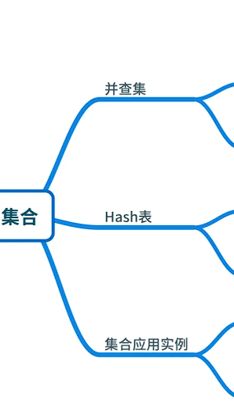
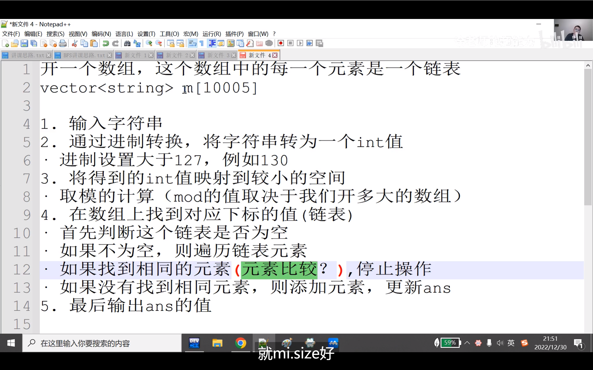

2025/9/25-10/7

## 集合并不仅仅局限于set
//set和multiset内部都是有序的（默认升序）set<int, greater<int>> s; // 降序排列的set
//set和multiset的区别
//（1）set内部的元素唯一不可重复但是multiset可以
//这道题并不适合用set 因为会破坏原本的顺序

//map和unorder_map的区别
//unordered_map内部是无序的 而map是有序的
//这个无序是真的无序 并不是按照原本的顺序

## 拓展域并查集。P1525 [NOIP 2010 提高组] 关押罪犯 、P_1892_BalticOI_2003_团伙
### 易错点：
合并的方向 详细见团伙这道题！！！

拓展域并查集，主要用于一种状态表示无法解决问题的题目。例如本题，一个开关有两种状态，用和不用。 

本文主要介绍二倍拓展域的拓展域并查集。 

什么是拓展域并查集？
拓展域并查集是一种数据结构，用于解决具有多个相互关系集合的问题。它是传统并查集的扩展，能够处理集合间的不同关系，如相互排斥或相互独立的关系。

拓展域并查集在写法上仅有初始化与两点连边与普通并查集不同。

## P_2814_家谱
### 易错点：
if(mp[fa]=="")mp[fa]=fa; 极其容易写成mp[fa]=fa; 这样会破坏原来可能已经初始好的关系

经常见 但总写不出来
##  埃氏筛：预处理 [2, max_num] 内的所有质数
void sieve(int max_num) {
    memset(is_prime, true, sizeof(is_prime));
    is_prime[0] = is_prime[1] = false; // 0和1不是质数
    for (int i = 2; i * i <= max_num; ++i) {
        if (is_prime[i]) { // 若i是质数，标记其所有倍数为非质数
            for (int j = i * i; j <= max_num; j += i) {
                is_prime[j] = false;
            }
        }
    }
}

//这个版本更容易理解
void sieve(int max_num)
{
    memset(is_pirme,1,sizeof is_prime);
    is_prime[0]=is_pirme[1]=false;
    for(int i=2;i<=max_num;i++)
    {
        if(is_prime[i])
        {
            //将素数i的倍数全都不是素数
            for(int j=2;i*j<=max_num;j++)
            is_prime[i*j]=0;
        }
    }
}

以下的题目掌握的不是很好
P1621 集合

P1525 [NOIP 2010 提高组] 关押罪犯

不要死记硬背 重在理解
二分目标	check(mid)含义（返回true表示）	check(mid) == true时移动	check(mid) == false时移动	最终目标值
找最小的可行mid	mid可行（存在更小可行值）	r = mid	l = mid	r 答案 r（哪边是true 那边就是答案）
找最大的可行mid	mid可行（存在更大可行值）	l = mid	r = mid	l

